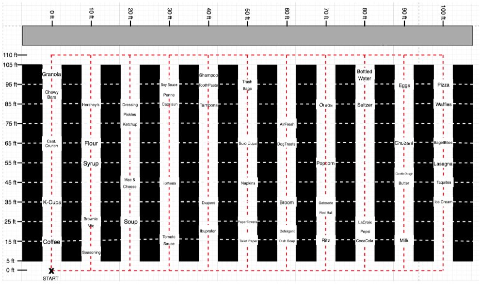

```{r setup, include=FALSE}
knitr::opts_chunk$set(echo = FALSE)
```

## Project Overview

A contestant in a gameshow has a default of 90 seconds to make their way around a grocery store, collect up to a default of 15 items in their cart, and return to the start.

Their score is the total cost of the items in their cart. Items are spread around the pictured aisles, and each have specific prices and locations.

{height=160}

## (a) asks:

For each pair of items $i,j\in[\![1,56]\!]$, compute the shortest time $d_{ij}$ to go from item $i$ to item $j$, and store these values. You may not use any optimization software to answer this question. Compute also the shortest time to travel between the start/end location and any item.

## (a) solution:

If two items are on the same x-aisle, the shortest distance from one to the other is the absolute value of the difference between their y-coordinates. We then divide the distance by the contestant's speed, 10 feet/second to convert this calculation to time.

If two items are on different x-aisle, the shortest distance from one to the other is either by moving up to the end of the aisle, across to the other item's aisle, and then down to the item, or by moving down to the start of the aisle, across to the other item's aisle, and then up to the item. An algorithm should choose the shortest of these two options, which could be done by taking the minimum of the two or by finding if the two item's y-values on average are closer to the end (110 ft) or the beginning (0 ft). 
We then divide the distance by the contestant's speed, 10 feet/second to convert this distance to time.

## (a) solution:


## (b) asks:

Formulate the Supermarket Sweep problem as a Mixed-Integer Program.

## (b) Data Placeholders:

$n$ represents the number of nodes, with node 1 being the start node, nodes 2,3,...,n being item nodes, and n+1 being the end node which shares the attributes of the start node.

$T$ represents the maximum time the contestant is given to shop.

$C$ represents the maximum amount of items the contestant can put in their cart.

$v_{i}$ represents the value of node $i$. $\forall i = 1, 2, ..., n$

$d_{ij}$ represents the minimum time it takes to move from node $i$ to node $j$. If node $j$ represents an item and not a start/end point, it will include the 2 seconds to add that item to the cart. $\forall i = 1, 2, ..., n$ $\forall j = 2, 3, ..., n+1$


## (b) Decision Variables:

$x_{ij} = 1$ if node $j$ follows node $i$ in the chosen path, 0 otherwise. $\forall i = 1, 2, ..., n$ $\forall j = 2, 3, ..., n+1$

$y_{j} = 1$ if node $j$ follows node $i$ in the chosen path, 0 otherwise. $\forall j = 1, 2, ..., n+1$

$t_{ij} = y_{j}$ if node $j$ follows node $i$ in the chosen path, 0 otherwise. $\forall i = 1, 2, ..., n$ $\forall j = 2, 3, ..., n+1$

## (b) Objective:

$$
\begin{aligned}
&\max_{x, y, t} &\textrm{score}&=\sum_{i=1}^nv_i\sum_{j=2}^{n+1}x_{ij}
\end{aligned}
$$

## (b) Constraint (1)

$$
\begin{aligned}
y_1 &= 0 \\ \\
\end{aligned}
$$


## (b) Constraint (2)

$$
\begin{aligned}
\sum_{j=2}^{n+1}x_{1,j}&=1
\end{aligned}
$$

## (b) Constraint (3)

$$
\begin{aligned}
\sum_{j=2}^{n+1}x_{ij}&\le1 &\forall i \in [\![2, n]\!]
\end{aligned}
$$

## (b) Constraint (4)

$$
\begin{aligned}
\sum_{j=2}^{n+1}x_{ij}&\le1 &\forall i \in [\![2, n]\!]
\end{aligned}
$$

## (b) Constraint (3)

$$
\begin{aligned}
\sum_{i=1}^{n}x_{ij}&\le1 &\forall j \in [\![2, n]\!]
\end{aligned}
$$

## (b) Constraint (5)

$$
\begin{aligned}
\sum_{i=1}^{n}x_{i,n+1}&=1
\end{aligned}
$$

## (b) Constraint (6)

$$
\begin{aligned}
t_{ij}&\le T x_{ij} &\forall i \in [\![1, n]\!] \ \ \ \ \ \ &\forall j \in [\![2, n+1]\!]
\end{aligned}
$$

## (b) Constraint (7)

$$
\begin{aligned}
y_j &= \sum_{i=1}^n t_{ij} &\forall j \in [\![2, n+1]\!]
\end{aligned}
$$

## (b) Constraint (8)

$$
\begin{aligned}
\sum_{k=2}^{n+1} t_{jk} &= y_j + \sum_{k=2}^{n+1} d_{jk}x_{jk} &\forall j \in [\![1, n]\!]
\end{aligned}
$$

## (b) Constraint (9)

$$
\begin{aligned}
x_{ii} &= 0 &\forall i \in [\![1, n]\!]
\end{aligned}
$$

## (b) Constraint (10)

$$
\begin{aligned}
\sum_{i=1}^{n}x_{ij}&= \sum_{k=2}^{n+1}x_{jk}  &\forall j \in [\![2, n]\!]
\end{aligned}
$$

## (b) Constraint (11)

$$
\begin{aligned}
\sum_{i=1}^n\sum_{j=2}^{n}x_{ij} &\le C
\end{aligned}
$$

## (b) Bound Constraints

$$
\begin{aligned}
x_{ij} &\in \{0,1\} &\forall i \in [\![1, n]\!] \ \ \ \ \ \ &\forall j \in [\![2, n+1]\!] \\ \\
t_{ij} &\ge 0 &\forall i \in [\![1, n]\!] \ \ \ \ \ \ &\forall j \in [\![2, n+1]\!]
\end{aligned}
$$


## (c) asks:

Code and solve your optimization model.  What is the optimal path?  Which items are picked?  What is the total value of these items?

## (c) solution:

Refer to code output

## (d) asks:

How does the optimal value of the problem vary with respect to the total amount of time allowed (initially set to 90 sec)?  Answer this question by plotting and analyzing the optimal value of the problem with different values of the total amount of time that is allowed.

## (d) solution:

```{r, echo=FALSE}
d_results = c(86.42, 94.41999999999999, 101.69999999999999, 112.67999999999999, 119.67999999999996, 128.66999999999996, 135.64999999999998, 138.64999999999998, 143.85, 148.64999999999998, 151.64999999999998, 153.85, 154.85, 154.85, 154.85, 154.85, 154.85)
times=50+(0:16)*5
plot(times, d_results, col="dark green", xlab="Number of seconds allotted to competitors (seconds)", ylab="Optimal value ($)", type='o')
```

## (d) solution:

## (e) asks:

How does the optimal value of the problem vary with respect to the capacity of the cart (initially set to 15)?  Answer this question by plotting and analyzing the optimal value of the problem with different values of the cart capacity.

## (e) solution:

```{r, echo=FALSE}
e_results=c(73.95, 83.94, 92.92999999999999, 101.91999999999999, 110.90999999999998, 118.89999999999998, 125.88999999999997, 132.87999999999997, 138.36999999999998, 140.05999999999997, 143.85, 147.64, 147.82999999999998, 148.82, 148.82, 148.82, 148.82, 148.82, 148.82, 148.82, 148.82)
capacities=c(5:25)
plot(capacities, e_results, col="blue", xlab="Maximum Number of Items Allowed In Cart", ylab="Optimal value ($)", type='o')
```

## (e) solution:


## (f) asks:

Consider the initial parameters of the problem (cart of size 15, time allowed of 90 seconds). Gurobi  has  a  parameter  called  MIPGap. Its  default  value  is  0.0001. This  means that Gurobi will output a solution, as soon as its objective value is within 0.01% of the optimal value of the problem. Changing  this parameter will influence the time it takes Gurobi to output a solution.  What happens if you change this Gurobi parameter for the Supermarket Sweep  problem?   Answer  this  question  by  plotting  and  analyzing  the  time  Gurobi  takes  to output  a  solution  with  respect  to  the  optimality  gap  that  is  allowed.

## (f) solution:

```{r, echo=FALSE}
f_results=c(55.552918910980225,51.73050308227539,49.226829051971436,48.2147171497345,46.99422883987427,40.8342010974884,35.21365284919739,7.805516004562378,0.9036610126495361,0.8991899490356445,0.8945901393890381)
mipgaps=c(10**-5,10**-4,10**-3,5*10**-3,10**-2,10**-(5/3),10**-(4/3),10**-1,10**-(2/3),10**-(1/3),10**0)
#mipgaps2=c(-4,)
plot(log(mipgaps,base=10), f_results, col="purple", xlab="log(MIPGap)", ylab="Runtime (seconds)", type='o')
```

## (f) solution:


